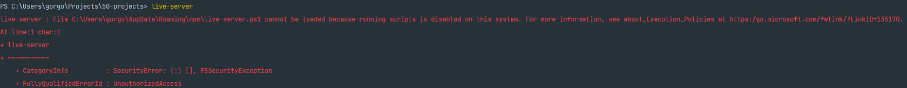

# 50 Projects

This repository contains 50 projects done with HTML, CSS and JavaScript.

The project uses the following technologies:
- `npm node-sass` for compiling of the scss files into css
- `npm live-server` for a local liver-server
- `npm css-reset-and-normalize` for the reset and normalization of css
- `7-1 Sass Architecture` [link](https://www.learnhowtoprogram.com/user-interfaces/building-layouts-preprocessors/7-1-sass-architecture)

## Set up

Run the following commands in the root directory:
- `npm install`
- `live-server --no-browser --ignore=scss/ .`
- `npm run css-watch`

**Important**: whenever you create a new `.scss` file, you need to end the watcher with:
- `ctrl + e` and start it again with:
- `npm run css-watch`

Other commands:
- `npm run css-compile` - online compiles the files without the watcher

## Troubleshooting:
### Running scripts is disabled on this system

If you try to run `live-server` you might run into the following error:

`live-server : File C:\Users\gorgo\AppData\Roaming\npm\live-server.ps1 cannot be loaded because running scripts is disabled on this system. For more information, see about_Execution_Policies at https:/go.microsoft.com/fwlink/?LinkID=135170.`

Fix: [link](https://stackoverflow.com/questions/63423584/how-to-fix-error-nodemon-ps1-cannot-be-loaded-because-running-scripts-is-disabl)

- Open PowerShell (Run As Administrator)
- Check the current execution policy using this command
    - `Get-ExecutionPolicy`
    - You should get `Restricted`
- Run this command to make it `Unrestricted`
    - `Set-ExecutionPolicy Unrestricted`
- Check again whether execution policy changed by running this command
    - `Get-ExecutionPolicy`
- You should get `Unrestricted`
- Run `live-server` again
